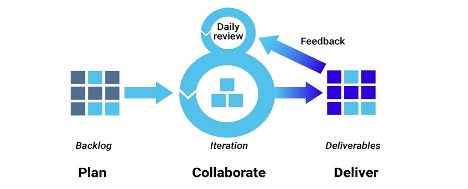

 <h1> CS-5279-50 Software Engineering Project 
(2021F) </h1>

 
<h2>
	Vanderbilt University  
	School of Engineering  
	Department of Computer Science  
</h2>
	

<strong> Term Project:</strong>  	
<h1> Project Tracker </h1> 

<strong> Group members:	</strong>  
            Taylor <strong> Watson </strong> 
			Mohammed <strong>Wardeh </strong>

<strong>Last update: <strong> 09/15/2021
 

<h1>
Project Tracker
</h1>
<h2>
Executive Summary
</h2>

	

<h3> Background </h3> 

The market is saturated with project management tools: paid and free; complex and simple; customizable and flat. The problem this project is trying to solve focuses on the subject matter of the class core topic breadth vis-a-vis creating a project to solve a real-life problem. One may argue that a real-life problem that requires computational capabilities may require a timeframe that exceeds the 10 weeks of the class – provided that the solution is a well-rounded and comprehensive one. The other challenge is the essential complexity of presenting any complex problem where the audience may not be relevant to the problem, consequently, may not be able to relate or appreciate the application. 

Therefore, our small team has decided to build a project development tracker. Almost all of software engineers and developers have used a similar tool in their lives. This will move the essential complexity of a life problem out of the way and have the audience focus on the technical aspects of building a project in software engineering. 

<h3>
Software Development Methodology 
<h3>
<h4>
Agile
</h4>

The methodology we will follow to develop the project will be Agile. This enables us to iteratively release and improve efficiency of development through quickly identifying fixes and defects and fixing them, so the project expectations are aligned early on. In the real world, agile is very helpful to users to realize benefits, use delivered features and suggest improvements.

 
<strong> Source: </strong> Synopsys – url: https://www.debutinfotech.com/blog/agile-development-accelerating-your-business-in-an-offshore-software-development-environment. 

<h4>
Version Control 
</h4>

We created a GitHub organization under https://github.com/ProTracking/projecTracker and then we created a GitHub repository under ProTracking Organization. Then we created a scaffold for the project following MVC design pattern. 

<h4>
Project Management
</h4>

GitHub Projects will be used to track the project progress. A Kanban board was created to track the status of the issues progress. Creating user stories is a work in progress. 

<h4>
Development Tech Stack
<h4>

The following tech stack will be utilized to deliver the MVP product: 

<ol>
<li>
<strong> Backend: </strong>  Java Spring Boot. 
</li>
<li>
<strong> Frontend: </strong>  HTML, CSS, Bootstrap and React.js. 
</li>
<li>

<strong> State Management: </strong> Apollo Client to manage data with GraphQL. 
</li>

</ol>

<h3>
Testing
</h3>
<strong> Backend: </strong>  Junit tests will be written to develop and perform regression testing. 
<strong> Front-end:</strong>  React Testing Libraries and / or Mocha JavaScript testing framework will be used. 

<h3>
Build
</h3>
Gradle building library will be used for the backend. 

<h3>
Deployment/Environment
</h3>
The project will be deployed to Heroku. A Heroku CLI will be installed and prepared in case a deploy-when-ready (DWR) for tiny updates after conducting a smoke test.

<h3>
Continuous Integration
</h3>
GitHub Action will be used for tasks automation during SDLC to run testing scripts. Corresponding workflows for all pushing events will be created to run the jobs of automation testing. 
